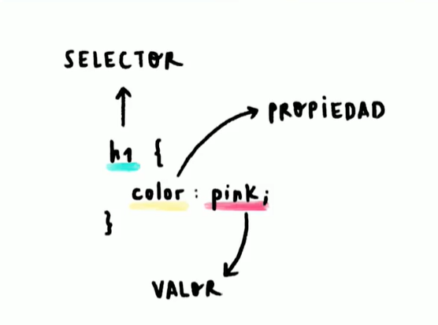

# 🎯 Anatomía de una declaración CSS: selectores, propiedades y valores

\
\
.\
Es normal que al principio pueda parecer “difícil”, pero realmente no lo es. CSS es un lenguaje muy simple y a la vez muy potente, puedes hacer desde cosas básicas (como estilizar algún elemento) ¡hasta cosas superavanzadas! (como hacer animaciones, por ejemplo) 😄.\
.\
CSS es tan fácil como agarrar cualquier elemento que tengas en tu HTML (por medio del selector) y dentro de las llavecitas poner en forma de lista los estilos que quieras, así es más fácil de verlo:\
.

```
agarra el botón y ponle {
    color: rojo;
    ancho: 20px;
    alto: 50px;
    tipo-de-letra: Arial;
}
```

.\
Obviamente aquí te lo puse en español, pero recuerda que la mayoría de lenguajes de programación son lo mismo, pero el principio y su forma de usarlos es el mismo 😌.\
.\
\

